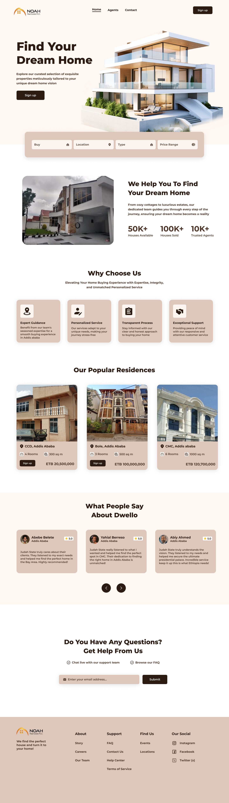
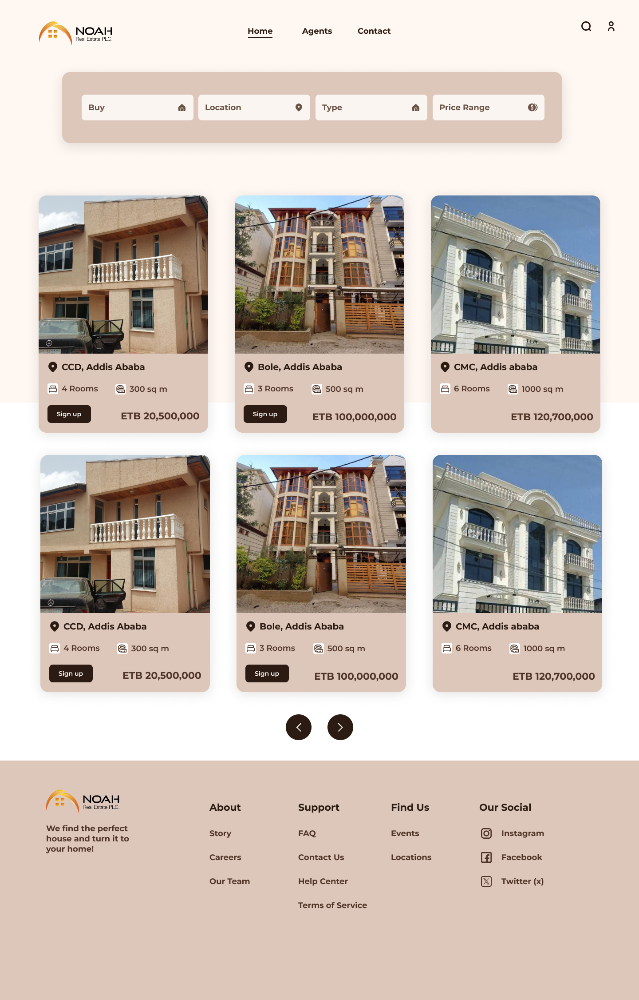

# Real Estate PWA

A TypeScript real-estate prototype for browsing homes, exploring agents, viewing property details, and testing property-management flows.

## Screenshots

  
  

## What It Does

- Shows a responsive real-estate homepage and property catalog.
- Lets visitors browse properties by location, type, price range, and search.
- Includes property detail pages with gallery preview and similar listings.
- Includes an agents page with broker profiles, ratings, filters, and contact-focused detail views.
- Includes a contact/dashboard area for editing profile information and managing user-created properties.
- Supports demo mode for public viewing and Postgres mode for local database-backed testing.

## Routes

- `/`
- `/properties`
- `/properties/:id`
- `/agents`
- `/agents/:id`
- `/contact`
- `/login`
- `/signup`

## Tools And Technologies

Frontend:
- React
- TypeScript
- Vite
- Lucide React icons
- CSS responsive layout

Backend:
- Node.js
- Express
- TypeScript
- `pg` for PostgreSQL access
- `dotenv` for environment configuration
- Node `crypto.scrypt` for password hashing

Database:
- PostgreSQL
- pgAdmin for visual inspection

Deployment:
- Vercel for the frontend demo deployment

## Data Modes

Demo mode is the default mode. It uses built-in fake data so the public site can be viewed without deploying a backend or database.

Postgres mode is available in the UI for local testing. When a local backend is running, it loads properties, agents, users, authentication, and property CRUD operations from PostgreSQL.

## Authentication

Demo mode does not require a real account. It is meant for quick public preview.

Postgres mode includes backend-integrated signup/signin:
- Signup collects name, username, email, phone, preferred area, password, and password confirmation.
- Signin checks username/email and password.
- Passwords are hashed before storage.
- User-created properties are linked to the signed-in database user.

## Database Schema

SQL schema:

[backend/sql/schema.sql](./backend/sql/schema.sql)

Human-readable schema notes:

[backend/DATABASE_SCHEMA.txt](./backend/DATABASE_SCHEMA.txt)

**Live Demo:** [https://addis-rent-pwa.vercel.app/](https://addis-rent-pwa.vercel.app/)

> Note: the deployed Vercel version runs in demo mode and uses fake/static showcase data. The Postgres mode is included for local backend/database testing, but the public deployment does not connect to a live database.

The schema includes:
- `users`
- `agents`
- `properties`
- `property_images`
- `inquiries`

Main relationships:
- Users can list many properties.
- Agents can broker many properties.
- Properties can have multiple gallery images.
- Inquiries can connect users, agents, and properties.
